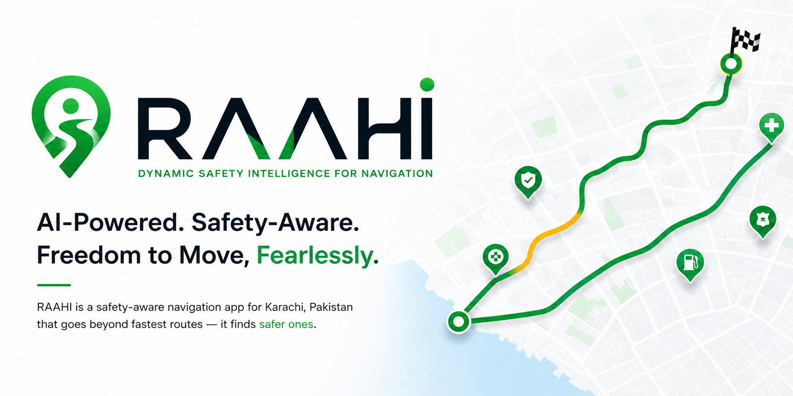

<p align="center">
  
</p>

<p align="center">
  
  
  
  
  
  
  
  
</p>

<div align="center">

## Raahi 

</div>
Dynamic Safety Intelligence for Navigation

RAAHI (راہِی — *The Traveler*) is an Android safety-aware navigation prototype designed specifically for Karachi, Pakistan. While conventional navigation platforms optimize purely for estimated time of arrival (ETA) or distance, RAAHI introduces a real-time safety layer that evaluates routes using multi-signal safety profiles, provides alternative corridor options, highlights verified Safe Points along the journey, and dynamically reacts to simulated environmental and road disruptions.

---

## 1. Project Overview

Navigating megacities like Karachi involves navigating hyper-localized real-world variables: variable street lighting, unpredictable traffic congestion, protest corridors, waterlogging during monsoons, and varying neighborhood safety signals. RAAHI was developed as a specialized proof-of-concept mobile application to demonstrate how navigation systems can balance travel efficiency with relative route safety.

The application focuses strictly on Karachi's urban geography—including prominent corridors across Saddar, Clifton, Defense Housing Authority (DHA), Gulshan-e-Iqbal, Shahrah-e-Faisal, I.I. Chundrigar Road, and Mai Kolachi Bypass.

---

## 2. Core Concept

RAAHI's core premise is **Safety Intelligence in Motion**:

- **Relative Safety Scoring**: Routes are analyzed and assigned a dynamic safety score (0–100) and qualitative safety badge (*Very High Safety*, *High Safety*, *Moderate Safety*, *Exercise Caution*).
- **Multi-Signal Evaluation**: The engine weighs five distinct safety dimensions:
  1. Historical Crime / Area Incident Tendency (Simulated baseline)
  2. Road Lighting & Visibility Infrastructure
  3. Commercial Density & Foot Traffic Activity
  4. Community Safety Reports & Incident Feedback
  5. Dynamic Real-Time Incidents (Protests, waterlogging, roadblocks)
- **Proactive Safe Points**: Identification of emergency hubs, 24/7 staffed pharmacies, hospitals, police facilitation centers, and lit fuel stations within reach along the route.
- **Dynamic In-Transit Recalculation**: If conditions shift while en route, RAAHI recalculates the current safety profile and prompts the commuter with actionable reroute alternatives.

---

## 3. Features Currently Implemented

The current version of RAAHI contains the following functional modules:

### A. Karachi Map & Visual Exploration
- Interactive **MapTiler**-powered map (rendered via an embedded MapTiler map view) centered on Karachi (`24.8607° N, 67.0011° E`).
- Real-time GPS location provider with fallback to Karachi South/Clifton coordinates when hardware GPS is unavailable or running in testing environments.
- Interactive Safe Point map markers with category-specific tinting (Hospitals, Police Facilitation, Fuel Stations, 24/7 Pharmacies).

### B. Destination Search & Selection
- Curated Karachi destination search catalog covering key districts (Clifton Beach, Dolmen Mall, Saddar Empress Market, LuckyOne Mall, Karachi University, Jinnah International Airport, etc.).
- Instant filtering by query or predefined Karachi neighborhood tags.
- Direct selection of Karachi destinations to immediately initiate multi-route planning.

### C. Multi-Route Planning & Alternatives
- Support for the live **TomTom Routing API** (`routing/1/calculateRoute`) when an API key is configured, including live-traffic-aware travel times and route alternatives.
- Built-in fallback to the **Karachi Corridor Routing Engine**, providing authentic alternative routes (e.g. *Via Khayaban-e-Iqbal & Club Rd*, *Via Shahrah-e-Faisal & Cantt*, *Via Mai Kolachi Bypass*) when operating without an active TomTom API key or when the request fails.
- Route comparison displaying duration, distance, relative safety score, and primary safety highlights.

### D. Safety Intelligence Engine & "Explain Why" Sheet
- Automated evaluation scoring for each calculated route.
- Detailed factor breakdown explaining the exact contributors to the score:
  - Street lighting conditions
  - Pedestrian & vehicular density
  - Baseline area incident trends
  - Active community flags
- Route Safety "Explain Why" bottom sheet showing pros, warnings, and safety recommendations.

### E. Safe Points Network
- Proximity-based lookup of verified safe hubs across Karachi.
- Filterable by type: *All*, *Police*, *Hospital*, *Fuel*, *Pharmacy*.
- Safe Point Detail Sheet showing address, operating hours, emergency contact, verified badge, and quick navigation actions.

### F. Active Journey Navigation
- Turn-by-turn navigation preview mode with active progress tracker.
- Live safety banner displaying the current corridor's safety status.
- In-journey route switcher allowing instant rerouting to safer alternatives.
- Journey completion screen with community trip safety rating dialog.

### G. Dynamic Demo & Simulation Control Panel
- Dedicated **Environment Control Screen** allowing demonstration of real-time safety shifts:
  - Street lighting outage simulation
  - Street protest / roadblock injection
  - Waterlogging event simulation
  - Crowd density spikes
- Immediate visual takeover dialog notifying the driver of safety degradation and offering one-tap safer alternative routes.

### H. Journey History & Commuter Profile
- Local history repository recording completed trips, safety scores, distances, and duration.
- Commuter profile view with saved emergency preferences and navigation statistics.

---

## 4. Technology Stack

- **Platform**: Android (Target API 36, Min API 24)
- **Language**: Kotlin 2.2.10
- **UI Framework**: Jetpack Compose with Material Design 3 (M3)
- **Architecture**: MVVM (Model-View-ViewModel) + Clean Architecture (Domain, Data, Presentation)
- **Asynchronous Flow**: Kotlin Coroutines & `StateFlow` / `collectAsStateWithLifecycle`
- **Networking**: Retrofit 2.12.0 + OkHttp 4.10.0 + Moshi 1.15.2 (Kotlin JSON codegen)
- **Maps & Routing**: MapTiler SDK (interactive Karachi map canvas) + TomTom Routing API (multi-route calculation with live traffic), Play Services Location 21.3.0
- **Local Persistence**: Android Jetpack Room 2.7.0 (with KSP)
- **Secrets Management**: Google Maps Secrets Gradle Plugin (`.env` / `BuildConfig`) — used purely as the `.env`-based secrets injection mechanism, not for Google Maps itself
- **Testing**: JUnit 4, Robolectric 4.16.1, Roborazzi 1.59.0 for Compose JVM screenshot testing

---

## 5. Android Requirements

- **Minimum Android Version**: Android 7.0 (API level 24 - Nougat)
- **Target / Compile SDK**: Android 16 (API level 36)
- **JDK Requirement**: Java 17 or Java 21 (Temurin / OpenJDK)
- **Build System**: Gradle 9.3.1 (Android Gradle Plugin 9.1.1)

---

## 6. Project Structure

```
Raahi
├── app/
│   ├── src/
│   │   ├── androidTest/
│   │   │   └── java/
│   │   │       └── com/
│   │   │           └── example/
│   │   │               └── ExampleInstrumentedTest.kt
│   │   ├── main/
│   │   │   ├── java/
│   │   │   │   └── com/
│   │   │   │       └── example/
│   │   │   │           ├── core/
│   │   │   │           │   └── location/
│   │   │   │           │       └── LocationProvider.kt
│   │   │   │           ├── data/
│   │   │   │           │   ├── datasource/
│   │   │   │           │   │   ├── KarachiCommunityFeedbackDataSource.kt
│   │   │   │           │   │   ├── KarachiDynamicConditionDataSource.kt
│   │   │   │           │   │   └── KarachiLocalDataSource.kt
│   │   │   │           │   ├── local/
│   │   │   │           │   │   └── ProfilePreferences.kt
│   │   │   │           │   ├── remote/
│   │   │   │           │   │   ├── GoogleRoutesApiService.kt
│   │   │   │           │   │   └── TomTomRoutingApiService.kt
│   │   │   │           │   ├── repository/
│   │   │   │           │   │   ├── CommunityFeedbackRepositoryImpl.kt
│   │   │   │           │   │   ├── DemoEventRepositoryImpl.kt
│   │   │   │           │   │   ├── DestinationRepositoryImpl.kt
│   │   │   │           │   │   ├── JourneyRepositoryImpl.kt
│   │   │   │           │   │   ├── RouteRepositoryImpl.kt
│   │   │   │           │   │   └── SafePointRepositoryImpl.kt
│   │   │   │           │   ├── safety/
│   │   │   │           │   │   ├── providers/
│   │   │   │           │   │   └── KarachiSafetyDataSource.kt
│   │   │   │           │   └── util/
│   │   │   │           │       └── PolylineDecoder.kt
│   │   │   │           ├── domain/
│   │   │   │           │   ├── model/
│   │   │   │           │   │   ├── CommunityFeedbackModels.kt
│   │   │   │           │   │   ├── DemoEventModels.kt
│   │   │   │           │   │   ├── JourneyModels.kt
│   │   │   │           │   │   ├── KarachiDestination.kt
│   │   │   │           │   │   ├── RaahiRoute.kt
│   │   │   │           │   │   └── SafetyModels.kt
│   │   │   │           │   ├── repository/
│   │   │   │           │   │   ├── CommunityFeedbackRepository.kt
│   │   │   │           │   │   ├── DemoEventRepository.kt
│   │   │   │           │   │   ├── DestinationRepository.kt
│   │   │   │           │   │   ├── JourneyRepository.kt
│   │   │   │           │   │   ├── RouteRepository.kt
│   │   │   │           │   │   └── SafePointRepository.kt
│   │   │   │           │   ├── safety/
│   │   │   │           │   │   ├── SafetyDataProviders.kt
│   │   │   │           │   │   ├── SafetyIntelligenceEngine.kt
│   │   │   │           │   │   ├── SafetyIntelligenceEngineImpl.kt
│   │   │   │           │   │   └── SafetySignalNormalizer.kt
│   │   │   │           │   └── usecase/
│   │   │   │           │       ├── ApplyDemoEventUseCase.kt
│   │   │   │           │       ├── CancelJourneyUseCase.kt
│   │   │   │           │       ├── CompleteJourneyUseCase.kt
│   │   │   │           │       ├── EvaluateRouteSafetyUseCase.kt
│   │   │   │           │       ├── GetCommunitySafetySignalUseCase.kt
│   │   │   │           │       ├── GetNearbySafePointsUseCase.kt
│   │   │   │           │       ├── PlanRouteUseCase.kt
│   │   │   │           │       ├── RecalculateActiveJourneySafetyUseCase.kt
│   │   │   │           │       ├── RecalculateSafetyUseCase.kt
│   │   │   │           │       ├── ResetDemoEventsUseCase.kt
│   │   │   │           │       ├── StartJourneyUseCase.kt
│   │   │   │           │       ├── SubmitCommunityFeedbackUseCase.kt
│   │   │   │           │       ├── SwitchJourneyRouteUseCase.kt
│   │   │   │           │       └── UpdateJourneyProgressUseCase.kt
│   │   │   │           ├── navigation/
│   │   │   │           │   ├── RaahiDestinations.kt
│   │   │   │           │   └── RaahiNavHost.kt
│   │   │   │           ├── presentation/
│   │   │   │           │   ├── components/
│   │   │   │           │   │   ├── ActiveNavigationOverlay.kt
│   │   │   │           │   │   ├── AnalyzingSafetySignalsOverlay.kt
│   │   │   │           │   │   ├── DedicatedRouteSelectionPanel.kt
│   │   │   │           │   │   ├── RaahiGlassBottomActionSheet.kt
│   │   │   │           │   │   ├── RaahiGlassBottomNavBar.kt
│   │   │   │           │   │   ├── RaahiGlassPanel.kt
│   │   │   │           │   │   ├── RaahiGlassSearchBar.kt
│   │   │   │           │   │   ├── RaahiGlassTopBar.kt
│   │   │   │           │   │   ├── RouteSafetyExplainWhySheet.kt
│   │   │   │           │   │   ├── SafePointDetailSheet.kt
│   │   │   │           │   │   ├── SafePointFilterBar.kt
│   │   │   │           │   │   ├── SafetyConditionsChangedTakeover.kt
│   │   │   │           │   │   └── TripCompletedFeedbackDialog.kt
│   │   │   │           │   ├── demo/
│   │   │   │           │   │   └── EnvironmentControlScreen.kt
│   │   │   │           │   ├── history/
│   │   │   │           │   │   └── HistoryScreen.kt
│   │   │   │           │   ├── home/
│   │   │   │           │   │   ├── HomeScreen.kt
│   │   │   │           │   │   ├── HomeState.kt
│   │   │   │           │   │   └── HomeViewModel.kt
│   │   │   │           │   ├── map/
│   │   │   │           │   │   ├── KarachiMapComponent.kt
│   │   │   │           │   │   └── MapTilerView.kt
│   │   │   │           │   ├── profile/
│   │   │   │           │   │   └── ProfileScreen.kt
│   │   │   │           │   ├── search/
│   │   │   │           │   │   ├── DestinationSearchScreen.kt
│   │   │   │           │   │   ├── SearchState.kt
│   │   │   │           │   │   └── SearchViewModel.kt
│   │   │   │           │   └── splash/
│   │   │   │           │       └── RaahiSplashScreen.kt
│   │   │   │           ├── ui/
│   │   │   │           │   └── theme/
│   │   │   │           │       ├── Color.kt
│   │   │   │           │       ├── Theme.kt
│   │   │   │           │       └── Type.kt
│   │   │   │           └── MainActivity.kt
│   │   │   ├── res/
│   │   │   │   ├── drawable/
│   │   │   │   │   ├── ic_launcher_background.xml
│   │   │   │   │   ├── ic_launcher_foreground.xml
│   │   │   │   │   ├── raahi_app_icon.png
│   │   │   │   │   └── splash_map_bg.png
│   │   │   │   ├── mipmap-anydpi-v26/
│   │   │   │   │   ├── ic_launcher_round.xml
│   │   │   │   │   └── ic_launcher.xml
│   │   │   │   ├── mipmap-hdpi/
│   │   │   │   │   ├── ic_launcher_round.webp
│   │   │   │   │   └── ic_launcher.webp
│   │   │   │   ├── mipmap-mdpi/
│   │   │   │   │   ├── ic_launcher_round.webp
│   │   │   │   │   └── ic_launcher.webp
│   │   │   │   ├── mipmap-xhdpi/
│   │   │   │   │   ├── ic_launcher_round.webp
│   │   │   │   │   └── ic_launcher.webp
│   │   │   │   ├── mipmap-xxhdpi/
│   │   │   │   │   ├── ic_launcher_round.webp
│   │   │   │   │   └── ic_launcher.webp
│   │   │   │   ├── mipmap-xxxhdpi/
│   │   │   │   │   ├── ic_launcher_round.webp
│   │   │   │   │   └── ic_launcher.webp
│   │   │   │   ├── values/
│   │   │   │   │   ├── colors.xml
│   │   │   │   │   ├── strings.xml
│   │   │   │   │   └── themes.xml
│   │   │   │   └── xml/
│   │   │   │       ├── backup_rules.xml
│   │   │   │       └── data_extraction_rules.xml
│   │   │   └── AndroidManifest.xml
│   │   └── test/
│   │       ├── java/
│   │       │   └── com/
│   │       │       └── example/
│   │       │           ├── CommunityFeedbackRepositoryTest.kt
│   │       │           ├── CommunityFeedbackViewModelTest.kt
│   │       │           ├── DestinationSearchNavigationRegressionTest.kt
│   │       │           ├── DynamicConditionDataSourceTest.kt
│   │       │           ├── DynamicRecalculationViewModelTest.kt
│   │       │           ├── ExampleRobolectricTest.kt
│   │       │           ├── ExampleUnitTest.kt
│   │       │           ├── GreetingScreenshotTest.kt
│   │       │           ├── HomeViewModelRouteTest.kt
│   │       │           ├── KarachiCommunityFeedbackProviderTest.kt
│   │       │           ├── PlanRouteUseCaseTest.kt
│   │       │           ├── PolylineDecoderTest.kt
│   │       │           ├── RaahiSplashScreenTest.kt
│   │       │           ├── RecalculateSafetyUseCaseTest.kt
│   │       │           ├── RouteRepositoryTest.kt
│   │       │           ├── SafePointRepositoryTest.kt
│   │       │           ├── SafetyIntelligenceEngineTest.kt
│   │       │           ├── SafetySignalNormalizerTest.kt
│   │       │           ├── SafetyViewModelIntegrationTest.kt
│   │       │           └── SubmitCommunityFeedbackUseCaseTest.kt
│   │       └── screenshots/
│   │           └── greeting.png
│   ├── build.gradle.kts
│   └── proguard-rules.pro
├── gradle/
│   ├── wrapper/
│   │   ├── gradle-wrapper.jar
│   │   └── gradle-wrapper.properties
│   └── libs.versions.toml
├── public/
│   └── assets/
│       └── aistudio/
├── build.gradle.kts
├── gradle.properties
├── gradlew
├── gradlew.bat
├── metadata.json
├── raahi_app_icon_1024.jpg
├── raahi_app_icon.png
├── README.md
├── settings.gradle.kts
├── splash_map_bg.jpg
├── test_icon.png
└── test_map.jpg
```

---

## 7. MapTiler Configuration

The application uses **MapTiler** to render the interactive Karachi map canvas (loaded through an embedded MapTiler-powered map view, `MapTilerView.kt`). Google Maps SDK is **not** used for map rendering in this project — the corresponding Google Maps API key meta-data entry is explicitly removed in `AndroidManifest.xml`.

1. Obtain an API key from the [MapTiler Cloud](https://cloud.maptiler.com/) dashboard.
2. Add your key to your `.env` file:
   ```env
   MAPTILER_API_KEY=YOUR_MAPTILER_API_KEY
   ```
3. `MapTilerView.kt` reads this key at runtime and injects it into the map view to load Karachi-centered vector tiles.
4. If running without a valid MapTiler key, the map view will fail to load tiles, but all other application panels, route calculations, safe points, and safety intelligence remain fully operational.

---

## 8. TomTom Routing Configuration

RAAHI connects to the **TomTom Routing API** (`https://api.tomtom.com/routing/1/calculateRoute/{locations}/json`) to fetch real-world routes, live-traffic-aware travel durations, distances, and turn-by-turn guidance instructions.

1. Create a free account and generate an API key from the [TomTom Developer Portal](https://developer.tomtom.com/).
2. In `.env`, set:
   ```env
   TOMTOM_API_KEY=YOUR_TOMTOM_API_KEY
   ```
3. **Automatic Fallback Mode**: When no valid TomTom key is provided (or when offline / the request fails), `RouteRepositoryImpl` automatically falls back to its built-in Karachi Corridor Engine. This engine generates authentic multi-route alternatives for major Karachi arterial corridors (Khayaban-e-Iqbal, Shahrah-e-Faisal, Mai Kolachi Bypass, etc.) without crashing or failing.

---

## 9. Environment / API Configuration

Copy `.env.example` to `.env` in the root directory:

```bash
cp .env.example .env
```

Populate the keys as required:

```env
# MapTiler API Key (interactive Karachi map rendering)
MAPTILER_API_KEY=YOUR_MAPTILER_API_KEY

# TomTom Routing API Key (route calculation, live traffic, turn-by-turn)
TOMTOM_API_KEY=YOUR_TOMTOM_API_KEY

# Optional: Gemini API Key (if server-side AI explanations are enabled)
GEMINI_API_KEY=YOUR_GEMINI_API_KEY
```

> **Security Notice**: `.env` is explicitly listed in `.gitignore` and must **never** be committed to version control.

> **Note**: The project's build config still declares a `MAPS_API_KEY` secrets placeholder for backward compatibility with the Secrets Gradle Plugin setup, but it is not used to render maps in the current version — MapTiler and TomTom are the active providers.

---

## 10. How to Build

### On Windows
```cmd
.\gradlew.bat assembleDebug
```

### On macOS / Linux
```bash
chmod +x gradlew
./gradlew assembleDebug
```

### Debug Keystore Note
If building on a fresh checkout where `debug.keystore` is not yet present, generate the standard Android debug keystore in the project root:
```bash
keytool -genkey -v -keystore debug.keystore -storepass android -alias androiddebugkey -keypass android -keyalg RSA -keysize 2048 -validity 10000 -dname "CN=Android Debug, O=Android, C=US"
```
*(The automated GitHub Actions CI workflow handles this step automatically).*

The compiled APK will be located at:
```
app/build/outputs/apk/debug/app-debug.apk
```

---

## 11. How to Run

### Via Android Studio
1. Open Android Studio and select **Open Project**.
2. Point to the root directory of this repository.
3. Allow Gradle to sync.
4. Select an Android Emulator (API 24+) or connect a physical Android device.
5. Click **Run 'app'** (`Shift + F10`).

### Via Command Line (ADB)
If ADB and an emulator/device are connected:
```bash
adb install -r app/build/outputs/apk/debug/app-debug.apk
adb shell am start -n com.aistudio.raahi.krchi/com.example.MainActivity
```

---

## 12. APK Installation

1. Download the pre-built `RAAHI-debug.apk` from the GitHub Actions Artifacts or Releases tab.
2. Transfer the `.apk` file to your Android phone (or download directly on device).
3. On your Android device:
   - Tap the downloaded file in your Downloads folder.
   - If prompted with *"For your security, your phone is not allowed to install unknown apps from this source"*, tap **Settings** and toggle **Allow from this source**.
   - Tap **Install**.
4. Launch **RAAHI** from your app drawer.

---

## 13. Testing

RAAHI includes a comprehensive automated test suite covering domain use cases, route calculations, polyline decoding, safety algorithms, and ViewModel state transitions:

```bash
# Run all unit and Robolectric tests
./gradlew :app:testDebugUnitTest
```

### Test Suite Highlights:
- **57 Passing Tests** across all core modules.
- `SafetyIntelligenceEngineTest`: Verifies multi-factor weighting, anomaly threshold calculations, and score normalization.
- `PlanRouteUseCaseTest`: Verifies route option sorting and fallback behaviors.
- `DynamicConditionDataSourceTest`: Verifies live environmental disruption propagation.
- `PolylineDecoderTest`: Verifies Google polyline encoding and decoding algorithms.
- `HomeViewModelRouteTest`: Verifies screen state lifecycles and navigation transitions.
- `GreetingScreenshotTest`: Robolectric + Roborazzi visual regression test.

---

## 14. Prototype Limitations

The current release is a specialized prototype with the following deliberate constraints:

1. **Karachi-Exclusive Geographic Scope**: The spatial databases, Safe Points, and corridor models are specifically calibrated for Karachi, Pakistan. Other cities are not currently modeled.
2. **Safety Signals Calibration**: Safety calculations are computed using a prototype intelligence engine incorporating calibrated baseline weights and simulated real-time events. They do not connect to official law enforcement live feeds.
3. **Simulated Sensor Feed**: In headless emulator environments where hardware GPS or gyroscope are inactive, the app defaults to simulated movement along the selected corridor.
4. **Offline Resilience**: When internet access is disconnected, the TomTom key is invalid, or API quotas are reached, routing automatically switches to the built-in Karachi corridor approximations.

---

## 15. Safety and Data Disclaimer

**IMPORTANT NOTICE & COMMUTER ADVISORY**

 1. **Relative Safety Indicator**: All safety scores, corridor badges, and warnings presented in RAAHI represent **relative comparative assessments based on available heuristic signals**. They do **NOT** constitute a guarantee, warranty, or absolute assurance of personal safety or route security.
 2. **Prototype Data**: Incident frequencies, street lighting estimates, and environmental disruptions in this prototype utilize simulated models, curated spatial reference points, and mock commuter contributions for demonstration purposes. They must not be interpreted as official crime statistics from the Sindh Police or Government of Pakistan.
 3. **Commuter Discretion**: Commuters must always prioritize their own situational awareness, official emergency advisories, real-world signage, law enforcement instructions, and personal judgment when traveling across Karachi.