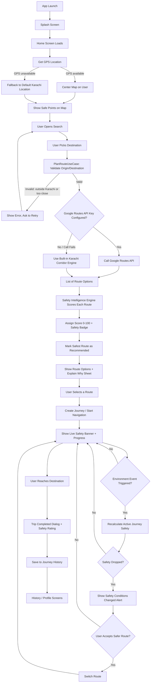

# RAAHI — App Workflow Documentation

This document explains, in plain English, how the RAAHI app actually works from the moment a
user opens it to the moment they finish a trip. It is meant as a companion to the main
`README.md`, which covers setup and tech stack. This file covers **behavior and flow**.

---

## 1. What the app does, in one paragraph

RAAHI is a navigation app for Karachi that does not just find the fastest route, it also scores
every route for **safety**. A user picks a starting point and a destination, the app fetches a
few route options, runs each one through a "Safety Intelligence Engine," and shows the user not
just travel time but also a safety score, a badge (like *High Safety* or *Exercise Caution*),
and the reasons behind that score. While the trip is in progress, the app keeps watching for
changes (like a simulated protest or a lighting outage) and will warn the user and offer a safer
alternative route if conditions change.

---

## 2. The complete step-by-step flow

### Step 1 — App launch
- `MainActivity` starts and shows the **RAAHI Splash Screen** first (branded loading animation).
- Once the splash animation finishes, the app switches (with a fade transition) to the main
  navigation host, `RaahiNavHost`.
- `RaahiNavHost` sets up one shared `HomeViewModel` that is reused across the Home, History, and
  Profile screens, so trip state stays consistent no matter which tab the user is on.

### Step 2 — Home screen loads
- The Home screen tries to get the phone's **current GPS location**.
- If GPS is unavailable (for example, running in an emulator with no location hardware), the app
  automatically falls back to a default Karachi location (Clifton / Karachi South) so the app
  never gets stuck.
- The interactive map is centered on Karachi and shows nearby **Safe Points** (hospitals, police
  facilitation centers, 24/7 pharmacies, fuel stations) as colored markers.

### Step 3 — Picking a destination
- The user taps search and lands on the **Destination Search screen**.
- They can either:
  - Pick a destination from a curated Karachi list (malls, beaches, universities, airport, etc.), or
  - Choose "Use current location" as the starting point.
- Once a destination is chosen, the app goes back to Home and automatically starts route
  planning.

### Step 4 — Route planning (`PlanRouteUseCase`)
Before any route is calculated, the app validates the request:
1. Origin and destination must both exist (not null).
2. Both points must fall inside Karachi's metropolitan boundary. Anything outside is rejected.
3. Origin and destination can't be almost the same point (less than 5 meters apart is rejected).

If validation passes, the app asks the **Route Repository** for route options:
- **If a Google Routes API key is configured:** it calls the real Google Routes API
  (`computeRoutes`) and decodes the returned polylines into actual road paths.
- **If no API key is configured, or the request fails:** the app automatically falls back to its
  own built-in **Karachi Corridor Routing Engine**, which knows realistic alternate paths along
  major Karachi roads (e.g. via Khayaban-e-Iqbal, via Shahrah-e-Faisal, via Mai Kolachi Bypass).

Either way, the user always ends up with a **list of route options** — this fallback design means
the app never simply fails to produce a route.

### Step 5 — Safety scoring (`SafetyIntelligenceEngine`)
Every route that comes back from Step 4 is passed through the Safety Intelligence Engine, which
scores it using five signals:
1. Historical / baseline area incident tendency
2. Street lighting and visibility along the corridor
3. Commercial density and foot traffic (busier areas generally feel safer)
4. Community-submitted safety feedback for that area
5. Any active real-time disruption (protest, waterlogging, roadblock, etc. — see Step 8)

The engine then:
- Assigns each route a **safety score from 0–100**.
- Assigns a **qualitative badge**: *Very High Safety*, *High Safety*, *Moderate Safety*, or
  *Exercise Caution*.
- Picks the route with the strongest safety profile and marks it as the **recommended** option.

### Step 6 — Reviewing route options
- The user sees all route alternatives side by side: duration, distance, and safety badge.
- Tapping **"Explain Why"** opens a bottom sheet that breaks the score down into plain-language
  reasons (lighting, density, incident trends, community flags) so the user understands *why*
  a route got its score, not just the number.
- The user picks whichever route they want (not forced to pick the "safest" one).

### Step 7 — Active journey / navigation
- Once a route is selected, a **Journey** is created and the app enters turn-by-turn navigation
  mode.
- A live overlay shows current progress and a **safety banner** for the corridor the user is
  currently on.
- The user can switch to a different alternative route mid-trip at any time via the in-journey
  route switcher.

### Step 8 — Dynamic recalculation (the "smart" part)
- There is a dedicated **Environment Control screen** used to simulate real-world disruptions:
  street lighting outages, protests/roadblocks, waterlogging, or crowd density spikes.
- When such an event is applied (in a real deployment this would come from live data instead of
  manual simulation), `RecalculateActiveJourneySafetyUseCase` re-runs the safety scoring for the
  active route and all its alternatives.
- If the current route's safety has dropped, the app shows a **"Safety Conditions Changed"**
  takeover screen, explains what changed, and offers a one-tap switch to a safer alternative.
- The user can accept the new route or continue on the original one.

### Step 9 — Trip completion
- When the destination is reached, the app shows a **trip completed** dialog and asks the user to
  rate the safety of the trip they just took (community feedback).
- This feedback is stored and folds back into future safety scoring for that area (signal #4 in
  Step 5).
- The completed trip (route, distance, duration, safety score) is saved into **Journey History**.

### Step 10 — History & Profile
- **History screen:** lists all past trips with their safety scores, distances, and durations.
- **Profile screen:** shows the commuter's saved name/photo and lets them jump back into planning
  a new journey or open the Environment Control (demo) screen.

---

## 3. Flow chart

---

## 4. Key building blocks referenced above

| Concept | What it means in this app |
|---|---|
| `PlanRouteUseCase` | Validates the trip request and asks for route options |
| `RouteRepositoryImpl` | Fetches real routes from Google, or falls back to Karachi corridors |
| `SafetyIntelligenceEngine` | Scores every route on safety and explains why |
| `RecalculateActiveJourneySafetyUseCase` | Re-checks safety of the current trip when conditions change |
| Safe Points | Verified hospitals, police centers, pharmacies, fuel stations shown on the map |
| Environment Control screen | Demo panel to simulate real-world disruptions (protest, lighting, flooding, crowd) |
| Journey History | Local record of completed trips and their safety outcomes |

---

